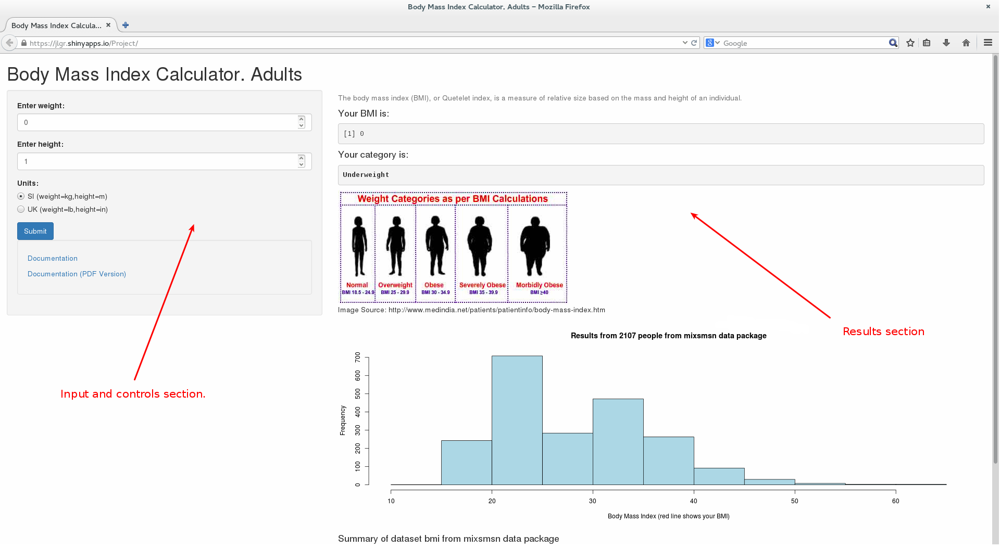
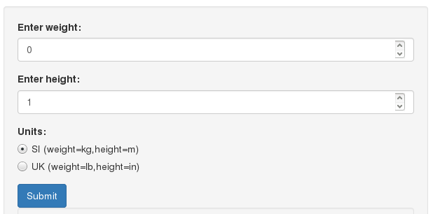
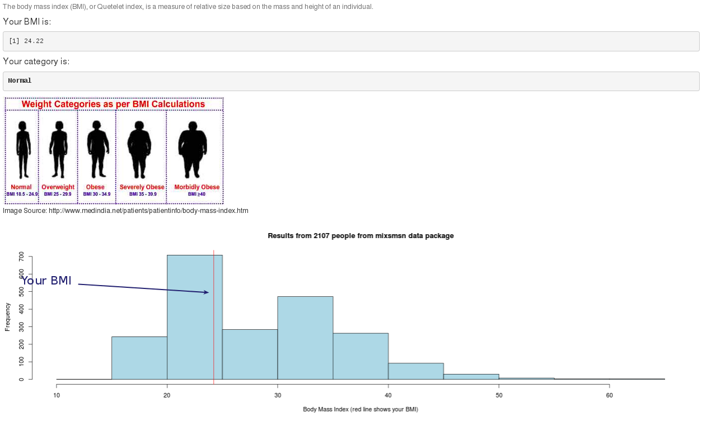
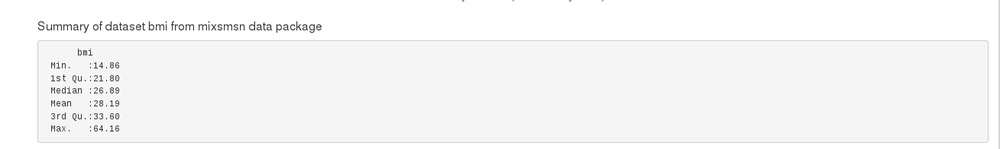
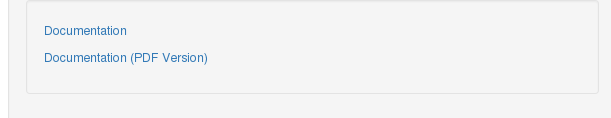

## Aim
The aim of BMI application is to calculate your Body Mass Index and show your current position related to a dataset included at mixsmsn R package. Data colection has BMI data from 2107 people.

Further information about mixsmsn package:

http://cran.r-project.org/web/packages/mixsmsn/index.html

## What is the Body Mass Index?
The body mass index (BMI), or Quetelet index, is a measure of relative size based on the mass and height of an individual.

The index was devised by Adolphe Quetelet during the course of developing what he called "social physics", between 1830 and 1850.[2] The BMI for a person is defined as their body mass divided by the square of their height—with the value universally being given in units of kg/m2. So if the weight is in kilograms and the height in metres, the result is immediate, if pounds and inches are used, a conversion factor of 703 (kg/m2)/(lb/in2) must be applied.
Source: Wikipedia http://en.wikipedia.org/wiki/Body_mass_index

   $$ \mathrm{BMI} = \frac{\text{mass}_\text{kg}}{\text{height}_\text{m}^2} = \frac{\text{mass}_\text{lb}}{\text{height}_\text{in}^2}\times 703 $$
   
##How can I use the application?

You can open the application at:

https://jlgr.shinyapps.io/Project/

## User guide

BMI application has two sections. Left section lets you introduce values and interact with controls, besides you can open this document in html or pdf format. Right section show the results from the application. Figure 1.

 Figure 1. 

### Input and results

You should enter the weight, height and metric system (by default SI) and then press submit button. Figure 2.

 
 Figure 2. 

Afer calculations you will see current Body Mass Index, Category, Category chart,distribution of dataset bmi from mixsmsn package, you will see with a red line your current BMI. Figure 3.

   Figure 3. 

Next summary of dataset will be displayed. Figure 4. 

  Figure 4. 

You can see this documentation by pressing links at left side. Figure 5.

 
  Figure 5. 

